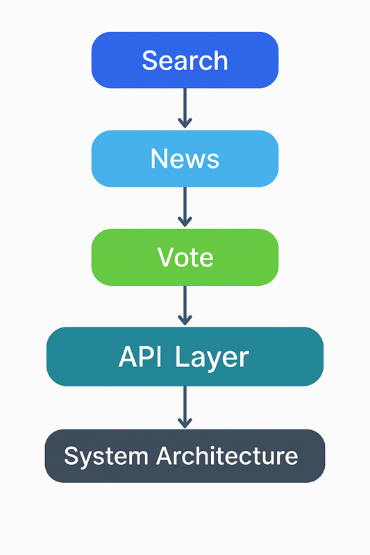

# KOFA‑3

<p align="center">
  
</p>

<p align="center">
  <a href="https://vercel.com"></a>
  <a href="https://github.com/jusbuckingham/kofa-3/blob/main/LICENSE"></a>
  <a href="https://github.com/jusbuckingham/kofa-3/actions"></a>
</p>

<p align="center">
  
</p>

**KOFA‑3** is the next evolution of the Kofa platform — an intelligent, agentic web application that combines **Search**, **News**, and **Vote** into a unified experience built around *Black Consciousness* and *AI autonomy*.

Developed using **Next.js 16**, **TypeScript**, and **Tailwind CSS**, KOFA‑3 is designed to think, search, and act agentically — using APIs and live internet data to generate insights from a Black American perspective.

---

## 🧠 Vision

Kofa‑3 is not just an app — it’s a new platform for *searching, learning, and deciding* through an African‑American lens.  
It reimagines how information, news, and civic engagement interact by letting AI agents interpret the world through culturally aware reasoning.

---

## ⚙️ Core Features

### 1. Agentic Search
- Uses internet access + APIs to provide live, context‑aware results.
- Agents interpret content through Black cultural, political, and economic frameworks.
- Capable of pulling academic sources, real‑time data, and verified news.

### 2. News
- Integrates free and open news APIs (NPR, Guardian, NYT, and others).
- Summarizes and reframes global events from a Black consciousness perspective.
- Falls back on RSS parsing for independent publishers.

### 3. Vote
- Intelligent civic agent uses the **Google Civic API** and **Ballotpedia API** to surface candidates, initiatives, and legislation.
- Ranks candidates by their alignment with issues impacting Black communities.
- Upcoming: direct voter registration and ballot info integration.

---

## 🧩 Tech Stack

| Layer | Technology |
|-------|-------------|
| Framework | Next.js 16 (App Router) |
| Language | TypeScript |
| Styling | Tailwind CSS v3 |
| Database | Planned Postgres or MongoDB (Vercel integrated) |
| APIs | Google Civic, Ballotpedia, custom Kofa endpoints |
| Hosting | Vercel |
| Auth | Kinde (planned) |
| Payments | Stripe (planned) |

---

## 🧱 Architecture Overview

- **Frontend:** React + Next.js App Router for SSR and ISR.
- **Backend:** Next.js API routes for data aggregation and AI agent calls.
- **Agent Layer:** Modular CrewAI / OpenAI Agents (Search, News, Vote).
- **Styling:** Tailwind CSS for responsive, minimal, accessible design.
- **Deployment:** Optimized for serverless execution on Vercel Edge Functions.

---

## 🚀 Local Development

### 1. Clone the repository
```bash
git clone https://github.com/jusbuckingham/kofa-3.git
cd kofa-3
```

### 2. Install dependencies
```bash
npm install
```

### 3. Run the dev server
```bash
npm run dev
```

Open [http://localhost:3000](http://localhost:3000) to see the app running.

---

## 🔐 Environment Variables

Create a `.env.local` file in the root directory with:

```env
NEXT_PUBLIC_API_URL=https://api.example.com
NEWS_API_KEY=your-news-api-key
CIVIC_API_KEY=your-google-civic-key
BALLOTPEDIA_API_KEY=your-ballotpedia-key
OPENAI_API_KEY=your-openai-api-key
```

Keep this file private — never commit secrets.

---

## ☁️ Deployment

**Deploy on Vercel**
1. Push to GitHub.
2. Import your repo into [Vercel](https://vercel.com).
3. Set your environment variables.
4. Vercel will auto‑build and deploy.

---

## 🧭 Roadmap

- [ ] Integrate Guardian / NPR / NYT agents for reliable news sourcing.
- [ ] Build civic agent using Google Civic + Ballotpedia.
- [ ] Add authentication (Kinde).
- [ ] Add Stripe billing for premium features.
- [ ] Launch user dashboard for saved searches and votes.
- [ ] Introduce historical Black literature dataset for contextual reasoning.
- [ ] PWA and mobile‑first optimization.
- [ ] Automated summarization and bias‑detection agent.

---

## 🤝 Contributing

Contributions, ideas, and partnerships are welcome.
To propose a feature or bug fix:
```bash
git checkout -b feature/my-idea
git commit -m "Add new feature"
git push origin feature/my-idea
```
Then open a pull request on GitHub.

---

## 📜 License
This project is licensed under the **MIT License**.

---

### ✊🏾 About KOFA

**KOFA AI** builds technology grounded in Black consciousness — empowering users to search, learn, and decide with awareness, context, and agency.

Visit [https://kofa.ai](https://kofa.ai) for more.
